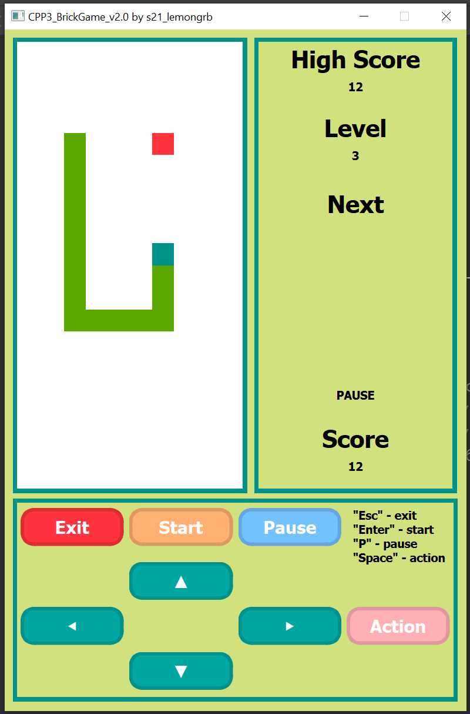
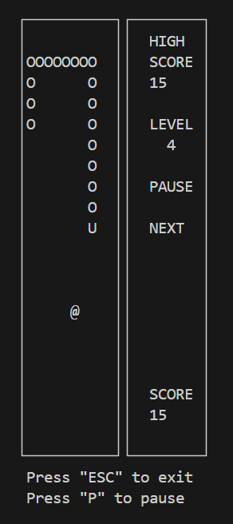
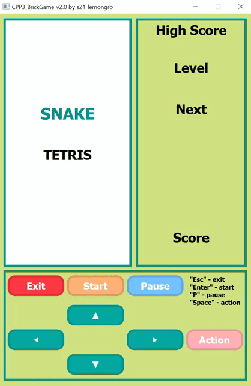
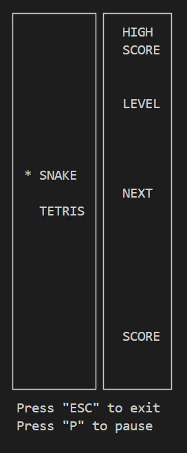
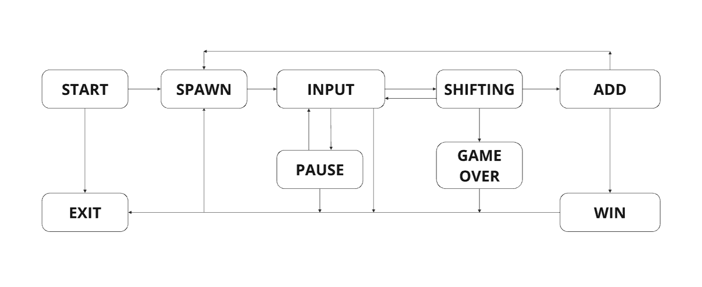

# Snake

## Содержание

1. [О проекте](#о-проекте)
2. [Особенности проекта](#особенности-проекта)
3. [Сборка](#сборка)

## О проекте

В данном учебном проекте "Школы 21" была реализована классическая игра Змейка, выполненная в консольной и десктопной версии. Игра имеет общее главное меню с игрой [Тетрис](https://github.com/Shyrasya/Tetris). Программа выполнена на:
* языке C++17;
* Qt 6 - визуализация десктопного интерфейса;
* Ncurses.h - библиотека для работы с консольной графикой;

  
	
	 
  <em>Игровое поле десктопной и консольной игры "Змейка"</em>

### Список возможностей программы:

* Змейка, начального размера 4 блока, передвигается на один блок по направлению движения головы самостоятельно после истечения таймера;
* "Съедая" яблоко, размер змеи увеличивается на один блок, счет также увеличивается на 1 значение. При достижении размера змеи 200 (количество съеденных яблочек/счет - 196) появляется окно, уведомляющее о выигрыше игрока и предлагающее сыграть снова либо же выйти из игры в главное поле;
* В игре существует возможность проигрыша, когда игрок выходит за рамки поля или змея пытается съесть саму себя. Соответственно всплывает окно "Game Over", где игрок также может выбрать, сыграть ли ему снова или выйти;
* Пользователь может управлять змейкой с помощью клавиш-стрелок на клавиатуре. В десктопной версии есть возможность управления кнопками из самого окна игры. К тому же змея может поворачивать только влево или вправо относительно текущего направления змеи;
* Присутствует механика ускорения змеи зажатием клавиши действие (пробел);
* В игре поддерживается режим паузы при нажатии на клавишу/кнопку;
* Игра может сохранять максимальное количество очков, набранное за игровую сессию, если было превышение текущего показателя. При повторном запуске вне зависимости от выбранного способа игры (десктоп/консоль) игра подгружает сохраненное значение для каждой игры (Змейка/Тетрис);
* При наборе 5 очков, уровень игры увеличивается на 1, одновременно повышается и скорость движения Змейки. Максимальное возможное количество уровней - 10;

  
	
	 
  <em>Демонстрация работы десктопной и консольной игры "Змейка"</em>

## Особенности проекта

В рамках учебного проекта неоходимо было соответствовать следующим требованиям при написании проекта:

* Программа разработана в соответствии с принципами объектно-ориентированного программирования;
* При написании кода необходимо придерживаться Google Style;
* Пользовательские классы реализованы с namespace "s21";
* Логика игры основана на конечном автомате (Finite State Machine, FSM);
* Игра использует паттерн MVC (model-view-controller), для связывания логической и графической части программы с помощью тонкого контроллера;
* Логика игры должна быть написана в соответсвии с приложенной к проекту спецификацией - обязательное наличие структуры GameInfo (для хранения игровой статистики), UserAction (для хранения всевозможных вариантов нажатий клавиш), функциями userInput (для обработки нажатия клавиш пользователем) и updateCurrentState (для получения данных для отрисовки в интерфейсе);
* Библиотека с логикой игры покрывается unit-тестами (используется GTest) более чем 80%;
* Игровое поле имеет размеры 10 пикселей в ширину, 20 - в высоту;
* Создание схемы, отображающей разработанный конечный игровой автомат для Змейки;

	

	

	*Конечный автомат "Змейки"*
	

## Сборка

Сборка игры "Змейка" производится с помощью Makefile. Имеются следующие цели:

**all** - включает в себя цели clean_all, gcov_report, dist;

**install** - собирает проект (дестопную и консольную версию) и перемещает его в папку build;

**install_cli** - собирает консольную версию и перемещает её в папку build;

**install_desktop** - собирает десктопную версию и перемещает её в папку build;

**play_cli** - запускает консольную версию Змейки;

**play_desktop** - запускает десктопную версию Змейки;

**uninstall** - удаляет папку build с проектом;

**clean_all** - возвращает проект в первоначальный вид;

**install_doxygen** - устанавливает Doxygen (инструмент для генерации документации из исходного кода);

**dvi** - генерирует докуменатацию с помощью Doxygen;

**dist** - создание архив-пакета, содержащего в себе все необходимые файлы и инструкции для установки игры;

**tests**, **start_tests** - Запустим unit-тесты на проверку логики игры с помощью библиотеки GTest;

**gcov_report** - генерация html-отчета с помощью lcov для измерения покрытия кода тестами;

**clang** - анализирует код на стилистические нормы; 

**cpp_check** - проверка кода на ошибки, уязвимости, неправильное использование переменных, операторов;

**valgrind** - проверка файла с тестами на возможные утечки.
